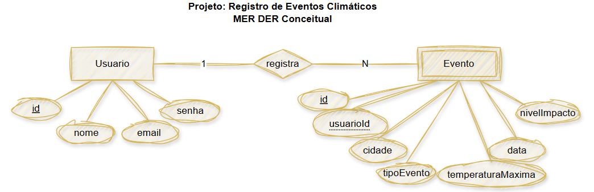
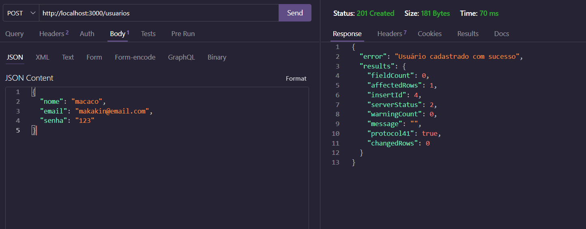
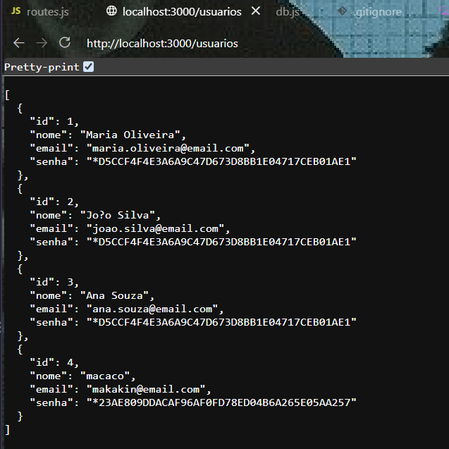

# Eventos Climáticos 2026
Foi revisado em sala de aula pelo professor Wellington (SENAI/SESI - Amparo) ``SQL``, ``JSON`` e ``JS`` de modo que seja criado um servidor funcional com usuários e sendo possível adicionar novos.
##### MER DER do projeto

##### Diagrama de Classes do projeto

## Tecnologias Utilizadas
* VS code
* mySQL
* Thunder Client

## Instruções para testar
1 Clone esse repositório
2 Abra-o no [VS Code](https://code.visualstudio.com/download?_exp_download=d53503e735)
3 Instale a extensão Thunder Client
4 Clique em "New Request"
5 Troque o link ao lado de GET por "http://localhost:3000/usuarios"
6 Clique no GET e troque-o por POST
7 Copie e cole, editando as informações:
``
{
  "nome": "macaco",
  "email": "makakin@email.com",
  "senha": "123"
}
``
8 Clique em SEND, e seu Thunder Client deverá ficar assim:

### Ao iniciar o servidor e ir em http://localhost:3000/usuarios o novo usuário aparecerá com os outros já cadastrados:

